  <picture>
    <source media="(prefers-color-scheme: dark)" srcset="./assets/hero-dark.svg">
    
  </picture>

I build 3D things that run in a browser tab: scene editors, 3D tours, simulations, and the glTF pipelines that keep them fast.

  <picture>
    <source media="(prefers-color-scheme: dark)" srcset="https://skillicons.dev/icons?i=ts,react,nextjs,threejs,go,nestjs,docker&theme=dark">
    
  </picture>

<a href="https://anhldh.com">anhldh.com</a>

